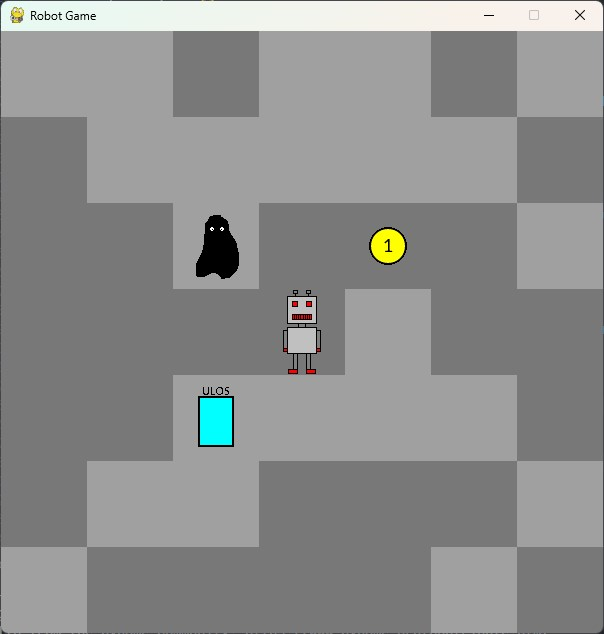

# Python Programming MOOC 2024 - Robot Game Project

This repository contains my final project in the University of Helsinki's Python Programming MOOC 2024. The instructions
for this exercise can be found here https://programming-23.mooc.fi/part-14/4-your-own-game.

Currently, this project is a tile-based game in which the player can control a robot.
 
## Game Design

The game will have the following design:

- The player controls a robot in a tile based map with walls and floors.
- Monsters are randomly placed throughout the map, and move around randomly every second.
- Coins are also placed randomly around the map for the player to collect.
- The player looses if they come into contact with a monster.
- The must a certain number of coins to win the game.

## Future Improvements

- One requirement of the MOOC submission was that it must be contained within a single python file. This makes the code hard to understand. Having one file per class would improve this.
- Random map generation
- Monster movement AI with player tracking
- Menu Menu and Game End screens
